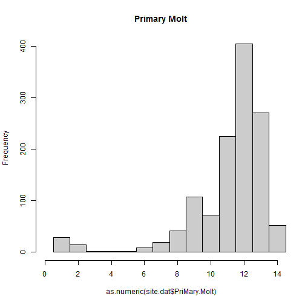
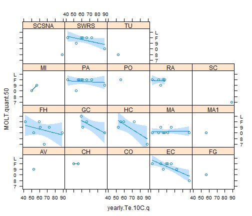
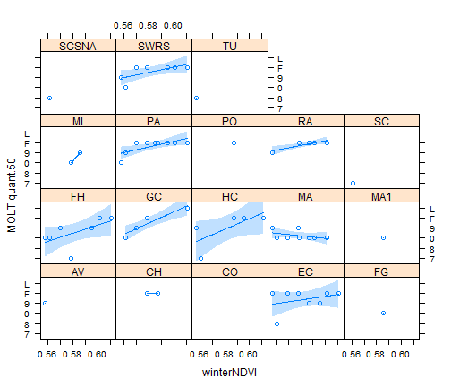

Model Molt Variation
========================================================

This document describes the model of Molt observed in Arizona and how it covaries with energetic demand and resource availability in Mexican wintering grounds


```r
# load the Hummingbird data; i.e. the d.f. site.dat
load("C:/Users/sarah/Dropbox/ActiveResearchProjects/Hummingbird_extreme_limits/site.dat.rdata")
# keep only the variables you need
site.dat <- site.dat[, c("LOC", "PriMary.Molt", "yearfac", "mofac")]
# make an ordered categorical variable describing primary molt
ordermolt <- function(x) {
    ordered(x, levels = c("M", "R", 1:8, 0, 9, "F", "L"))
}
site.dat$PriMary.Molt <- ordermolt(site.dat$PriMary.Molt)
hist(as.numeric(site.dat$PriMary.Molt), col = "grey80", xlim = c(0, 14), breaks = seq(0.5, 
    14.5, by = 1), main = "Primary Molt")
```

 


```r
# Calculate quantiles of molt distribution per site & year
# ('Molt.quant...'). quant.50 indicates the median molt stage at a given
# site and year


getMOLTquant <- function(quantile.) {
    tapply(site.dat$PriMary.Molt, INDEX = list(site.dat$LOC, site.dat$yearfac), 
        FUN = quantile, type = 1, probs = c(quantile.), na.rm = T)
}

MOLT.quant.05 <- ordermolt(levels(site.dat$PriMary.Molt)[as.vector(getMOLTquant(0.05))])
MOLT.quant.25 <- ordermolt(levels(site.dat$PriMary.Molt)[as.vector(getMOLTquant(0.25))])
MOLT.quant.50 <- ordermolt(levels(site.dat$PriMary.Molt)[as.vector(getMOLTquant(0.5))])
MOLT.quant.75 <- ordermolt(levels(site.dat$PriMary.Molt)[as.vector(getMOLTquant(0.75))])
MOLT.quant.95 <- ordermolt(levels(site.dat$PriMary.Molt)[as.vector(getMOLTquant(0.95))])
MOLT.quants <- cbind.data.frame(MOLT.quant.05, MOLT.quant.25, MOLT.quant.50, 
    MOLT.quant.75, MOLT.quant.95)
rm(MOLT.quant.05, MOLT.quant.25, MOLT.quant.50, MOLT.quant.75, MOLT.quant.95)

# calculate variables to hold the site names ('LOC') and years ('yr')
# associated with the quantiles
quant.temp <- tapply(site.dat$PriMary.Molt, INDEX = list(site.dat$LOC, site.dat$yearfac), 
    FUN = quantile, type = 1, probs = c(0.05), na.rm = T)
LOC <- rownames(quant.temp)
yr <- rep(colnames(quant.temp), each = length(LOC))
rm(quant.temp)

# calculate the nr of birds in each sample ('n.birds')
n.birds <- as.vector(tapply(site.dat$PriMary.Molt, INDEX = list(site.dat$LOC, 
    site.dat$yearfac), FUN = function(x) {
    length(which(!is.na(x)))
}))

# save the new metrics in the d.f. 'MOLT.quants'
MOLT.quants <- cbind.data.frame(LOC, yr, n.birds, MOLT.quants)
rm(n.birds, LOC, yr)
```


Load the yearly climate (and NDVI) data which will serve as predictors and merge it with the molt metrics in the data frame 'yearly.molt.stat' to be used for modelling

```r
load("C:/Users/sarah/Dropbox/ActiveResearchProjects/Hummingbird_extreme_limits/yearly.climate.rdata")
# gives you yearly.climate
yearly.molt.stat <- merge(x = MOLT.quants, y = yearly.climate, by = "yr")
rm(MOLT.quants, yearly.climate)
```


Plot molt responses to a proxy for physiological (yearly.Te.10C.q) demand and resrouce availability (NDVI)

```r
require(lattice)
```

```
## Loading required package: lattice
```

```r
require(latticeExtra)
```

```
## Loading required package: latticeExtra
## Loading required package: RColorBrewer
```

```r
xyplot(MOLT.quant.50 ~ yearly.Te.10C.q | LOC, data = yearly.molt.stat) + layer(panel.smoother(x, 
    y, method = "lm"))
```

 

```r
xyplot(MOLT.quant.50 ~ winterNDVI | LOC, data = yearly.molt.stat) + layer(panel.smoother(x, 
    y, method = "lm"))
```

 


Load a function ('mod.evaluation') to evaluate hierarchical models

```r
source("C:/Users/sarah/Documents/GitHub/extreme_limits/Model_evaluation_v4.r")
```

```
## Loading required package: lme4
```

```
## Warning: package 'lme4' was built under R version 3.0.3
```

```
## Loading required package: Matrix
```

```
## Warning: package 'Matrix' was built under R version 3.0.3
```

```
## Loading required package: Rcpp
```

```
## Warning: package 'Rcpp' was built under R version 3.0.3
```

```
## Loading required package: bbmle
```

```
## Warning: package 'bbmle' was built under R version 3.0.3
```

```
## Loading required package: stats4
```


Using  function evaluate hierarchical models of median Molt stage (50th Percentile of Molt) as a 
linear function of annual physiological demand and resource availability, allowing for a 
random intercept associated with 'site' 
Binomial, using winter NDVI as resource AVAILABILITY

```r
attach(yearly.molt.stat)
# http://www.quantpsy.org/interact/interactions.htm
mod.evaluation(yname = "MOLT.quant.50", centering = "CGM", stand = T, ordered.fac.treatment = "as.binomial", 
    log.D = T, R = "winterNDVI", D = "yearly.Te.10C.q")
```

```
## samples will be weighted by 'n.birds' in model calibration
## DEMAND variable will be log-transformed
## 
## Correlation between D and R (after transform and or subset):
## 
## 	Pearson's product-moment correlation
## 
## data:  D and R
## t = -4.78, df = 196, p-value = 3.436e-06
## alternative hypothesis: true correlation is not equal to 0
## 95 percent confidence interval:
##  -0.4426 -0.1923
## sample estimates:
##     cor 
## -0.3231 
## 
## 
##  MOLT.quant.50  is an ordered factor. options are to treat as numeric or in a binomial fashion !!!
## MOLT.quant.50  is an ordered factor and will be converted to a count table !!!
## 
## Predictor variables were centered at the grand mean (CGM)
## 
## Predictor variables were standardised using grand sd
```

```
## Conditional effects of predictors in full model, i.e. including R*D interaction
```

 

```
## 
## AIC of best model: 2851 
## 
## Model evaluation completed and tabulated:
```

```
##         mod.name dAICc.lib dAICCc.con df A.weight D_low D_high R_low
## mod.DR    mod.DR       0.0        0.0  5        1 -0.23  -0.03  0.26
## mod.D_R  mod.D_R      17.4       15.6  4        0 -0.38  -0.25  0.32
## mod.R      mod.R     116.7      113.7  3        0    NA     NA  0.48
## mod.D      mod.D     122.5      119.5  3        0 -0.51  -0.39    NA
## mod.0      mod.0     369.4      365.7  2        0    NA     NA    NA
##         R_high DR_low DR_high D_est R_est DR_est
## mod.DR    0.42   0.09    0.22 -0.13  0.34   0.16
## mod.D_R   0.47     NA      NA -0.32  0.40     NA
## mod.R     0.62     NA      NA    NA  0.55     NA
## mod.D       NA     NA      NA -0.45    NA     NA
## mod.0       NA     NA      NA    NA    NA     NA
```

```r
detach(yearly.molt.stat)
```


Using function evaluate hierarchical models of 25th percentile Molt stage as a linear function of annual physiological demand and resource availability, allowing for a random intercept associated with 'site' 
Binomial, using winter NDVI as resource AVAILABILITY

```r
attach(yearly.molt.stat)
# http://www.quantpsy.org/interact/interactions.htm
mod.evaluation(yname = "MOLT.quant.25", centering = "CGM", stand = T, ordered.fac.treatment = "as.binomial", 
    log.D = T, R = "winterNDVI", D = "yearly.Te.10C.q")
```

```
## samples will be weighted by 'n.birds' in model calibration
## DEMAND variable will be log-transformed
## 
## Correlation between D and R (after transform and or subset):
## 
## 	Pearson's product-moment correlation
## 
## data:  D and R
## t = -4.78, df = 196, p-value = 3.436e-06
## alternative hypothesis: true correlation is not equal to 0
## 95 percent confidence interval:
##  -0.4426 -0.1923
## sample estimates:
##     cor 
## -0.3231 
## 
## 
##  MOLT.quant.25  is an ordered factor. options are to treat as numeric or in a binomial fashion !!!
## MOLT.quant.25  is an ordered factor and will be converted to a count table !!!
## 
## Predictor variables were centered at the grand mean (CGM)
## 
## Predictor variables were standardised using grand sd
```

```
## Conditional effects of predictors in full model, i.e. including R*D interaction
```

 

```
## 
## AIC of best model: 3267 
## 
## Model evaluation completed and tabulated:
```

```
##         mod.name dAICc.lib dAICCc.con df A.weight D_low D_high R_low
## mod.DR    mod.DR       0.0        1.1  5      0.8 -0.51  -0.26  0.38
## mod.D_R  mod.D_R       0.7        0.0  4      0.2 -0.55  -0.44  0.43
## mod.D      mod.D     184.7      182.8  3      0.0 -0.73  -0.62    NA
## mod.R      mod.R     371.0      369.1  3      0.0    NA     NA  0.68
## mod.0      mod.0     951.0      948.3  2      0.0    NA     NA    NA
##         R_high DR_low DR_high D_est R_est DR_est
## mod.DR    0.56  -0.01    0.17 -0.39  0.47   0.08
## mod.D_R   0.59     NA      NA -0.49  0.51     NA
## mod.D       NA     NA      NA -0.67    NA     NA
## mod.R     0.82     NA      NA    NA  0.75     NA
## mod.0       NA     NA      NA    NA    NA     NA
```

```r
detach(yearly.molt.stat)
```

