Model Weight Variation
========================================================

This document describes the model of Weight observed in Arizona and how it covaries with energetic demand and resource availability in Mexican wintering grounds


```r
# load the Hummingbird data; i.e. the d.f. site.dat
load("C:/Users/sarah/Dropbox/ActiveResearchProjects/Hummingbird_extreme_limits/site.dat.rdata")
```


How does weight vary with fat?

```r
# fat classes 0 and P can be lumped
site.dat$Fat[site.dat$Fat == "P"] <- 0
orderfat <- function(x) {
    ordered(x, levels = c(0, "T", 1:3))
}
site.dat$Fat <- orderfat(site.dat$Fat)
plot(site.dat$Weight ~ site.dat$Fat, col = "light grey", xlab = "Fat", ylab = "Weight", 
    pch = 19, cex.axis = 2, cex.lab = 2)
```

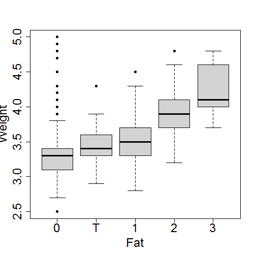 


Weight does not strongly vary with molt

```r
ordermolt <- function(x) {
    ordered(toupper(x), levels = c("M", "R", 1:8, 0, 9, "F", "L"))
}
site.dat$PriMary.Molt <- ordermolt(site.dat$PriMary.Molt)
plot(site.dat$Weight ~ site.dat$PriMary.Molt, col = "light grey", pch = 19, 
    xlab = "Primary Molt", ylab = "Weight", cex.axis = 2, cex.lab = 2)
```

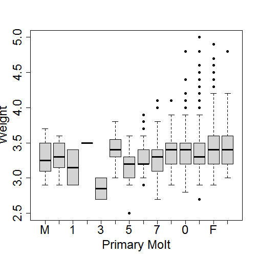 


FYI: How are observations distributed across Molt classes?

```r
table(site.dat$PriMary.Molt)
```

```
## 
##   M   R   1   2   3   4   5   6   7   8   0   9   F   L 
##  28  15   2   1   2   8  19  41 107  72 225 404 270  52
```


Which pairs of primary molt classes differ in weight?

```r
tt <- round(sort(TukeyHSD(aov(site.dat$Weight ~ site.dat$PriMary.Molt))[[1]][, 
    4]), 3)
tt[tt < 0.2]
```

```
##   F-7   F-5   L-5   9-5   0-5   F-6   9-7   8-5 
## 0.002 0.002 0.019 0.027 0.037 0.123 0.163 0.181
```


Which pairs of secondary molt classes differ in weight?

```r
site.dat$Secondary.Molt <- ordermolt(site.dat$Secondary.Molt)
plot(site.dat$Weight ~ site.dat$Secondary.Molt, col = "light grey")
```

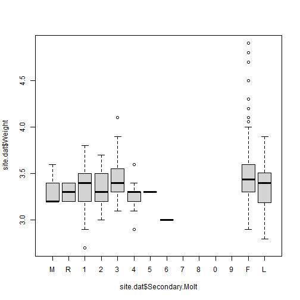 

```r
table(site.dat$Secondary.Molt)
```

```
## 
##   M   R   1   2   3   4   5   6   7   8   0   9   F   L 
##   3   2  54  27  27  12   1   1   0   0   0   0 154  23
```

```r
tt <- round(sort(TukeyHSD(aov(site.dat$Weight ~ site.dat$Secondary.Molt))[[1]][, 
    4]), 3)
tt[tt < 0.2]
```

```
##   F-1   F-4 
## 0.063 0.164
```


Which pairs of body molt classes differ in weight?

```r
site.dat$Body.Molt <- ordermolt(site.dat$Body.Molt)
plot(site.dat$Weight ~ site.dat$Body.Molt, col = "light grey", xlab = "Body Molt Class", 
    ylab = "Weight")
```

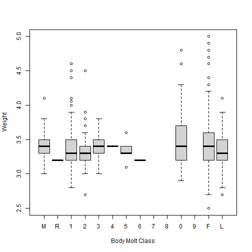 

```r
table(site.dat$Body.Molt)
```

```
## 
##   M   R   1   2   3   4   5   6   7   8   0   9   F   L 
##  21   1 354 100  23   1   5   1   0   0 113   0 509 113
```

```r
tt <- round(sort(TukeyHSD(aov(site.dat$Weight ~ site.dat$Body.Molt))[[1]][, 
    4]), 3)
tt[tt < 0.2]
```

```
##   L-0   0-1   0-2 
## 0.027 0.051 0.093
```


Which pairs of gorget/head molt classes differ in weight?

```r
site.dat$Gorget.head.molt <- ordermolt(site.dat$Gorget.head.molt)
plot(site.dat$Weight ~ site.dat$Gorget.head.molt, col = "light grey", xlab = "gorget head molt", 
    ylab = "Weight")
```

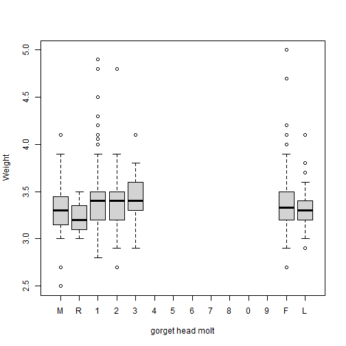 

```r
table(site.dat$Gorget.head.molt)
```

```
## 
##   M   R   1   2   3   4   5   6   7   8   0   9   F   L 
##  28   3 182  93  40   0   0   0   0   0   0   0 202  93
```

```r
tt <- round(sort(TukeyHSD(aov(site.dat$Weight ~ site.dat$Gorget.head.molt))[[1]][, 
    4]), 3)
tt[tt < 0.2]
```

```
## named numeric(0)
```


Which pairs of tail molt classes differ in weight?

```r
site.dat$Tail.Molt <- ordermolt(site.dat$Tail.Molt)
plot(site.dat$Weight ~ site.dat$Tail.Molt, col = "light grey", xlab = "tail molt", 
    ylab = "Weight")
```

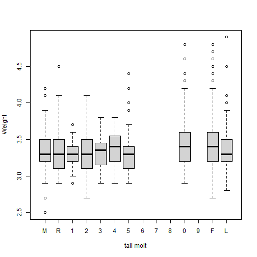 

```r
table(site.dat$Tail.Molt)
```

```
## 
##   M   R   1   2   3   4   5   6   7   8   0   9   F   L 
## 103  51  19  41  36  32 131   0   0   0 221   0 442 126
```

```r
tt <- round(sort(TukeyHSD(aov(site.dat$Weight ~ site.dat$Tail.Molt))[[1]][, 
    4]), 3)
tt[tt < 0.2]
```

```
##   F-5   0-5 
## 0.005 0.032
```


Keep only the variables you need for the modelling analysis

```r
site.dat <- site.dat[, c("LOC", "Weight", "Fat", "yearfac", "mofac")]
```


Load the yearly climate (and NDVI) data which will serve as predictors and merge it with the weight metrics in the data frame 'yearly.weight.stat' to be used for modelling

```r
load("C:/Users/sarah/Dropbox/ActiveResearchProjects/Hummingbird_extreme_limits/yearly.climate.rdata")
# gives you yearly.climate
yearly.weight.stat <- merge(x = site.dat, y = yearly.climate, by.x = "yearfac", 
    by.y = "yr")
rm(site.dat, yearly.climate)
```


Plot molt responses to a proxy for physiological (yearly.Te.10C.q) demand and resource availability (NDVI)

```r
require(lattice)
```

```
## Loading required package: lattice
```

```r
require(latticeExtra)
```

```
## Loading required package: latticeExtra
## Loading required package: RColorBrewer
```

```r
xyplot(Weight ~ yearly.Te.10C.q | LOC, data = yearly.weight.stat) + layer(panel.smoother(x, 
    y, method = "lm"))
```

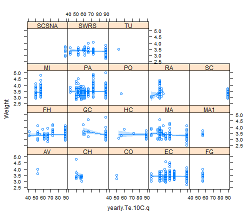 

```r
xyplot(Weight ~ winterNDVI | LOC, data = yearly.weight.stat) + layer(panel.smoother(x, 
    y, method = "lm"))
```

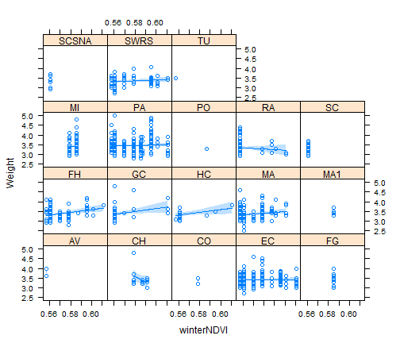 

```r

xyplot(Fat ~ yearly.Te.10C.q | LOC, data = yearly.weight.stat) + layer(panel.smoother(x, 
    y, method = "lm"))
```

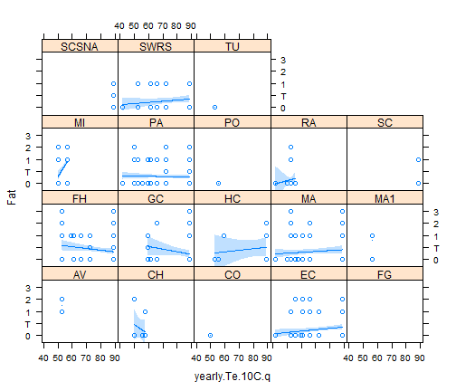 

```r
xyplot(Fat ~ winterNDVI | LOC, data = yearly.weight.stat) + layer(panel.smoother(x, 
    y, method = "lm"))
```

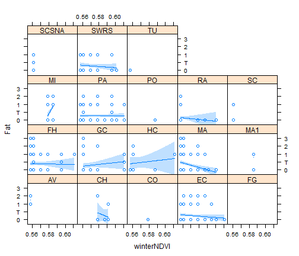 


Load a function ('mod.evaluation') to evaluate hierarchical models

```r
source("C:/Users/sarah/Documents/GitHub/extreme_limits/Model_evaluation_v4.r")
```

```
## Loading required package: lme4
```

```
## Warning: package 'lme4' was built under R version 3.0.3
```

```
## Loading required package: Matrix
```

```
## Warning: package 'Matrix' was built under R version 3.0.3
```

```
## Loading required package: Rcpp
```

```
## Warning: package 'Rcpp' was built under R version 3.0.3
```

```
## Loading required package: bbmle
```

```
## Warning: package 'bbmle' was built under R version 3.0.3
```

```
## Loading required package: stats4
```


Using aforementioned function evaluate hierarchical models of WEIGHT as a linear function of annual physiological demand and resource availability, allowing for a random intercept associated with 'site' 

```r
attach(yearly.weight.stat)
# http://www.quantpsy.org/interact/interactions.htm
mod.evaluation(yname = "Weight", centering = "CGM", stand = T, ordered.fac.treatment = "as.num", 
    log.D = T, R = "winterNDVI", D = "yearly.Te.10C.q", N = NULL)
```

```
## all samples will be equally weighted calibration
## DEMAND variable will be log-transformed
## 
## Correlation between D and R (after transform and or subset):
## 
## 	Pearson's product-moment correlation
## 
## data:  D and R
## t = -14.62, df = 1316, p-value < 2.2e-16
## alternative hypothesis: true correlation is not equal to 0
## 95 percent confidence interval:
##  -0.4193 -0.3263
## sample estimates:
##     cor 
## -0.3737 
## 
## 
## Predictor variables were centered at the grand mean (CGM)
## 
## Predictor variables were standardised using grand sd
```

```
## Conditional effects of predictors in full model, i.e. including R*D interaction
```

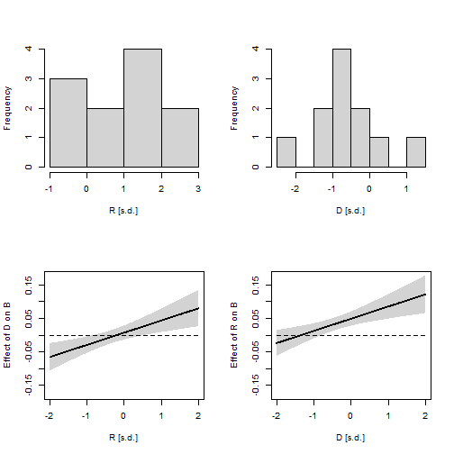 

```
## 100*R2 for linear model mod.DR.lm : 
## 4 
## 100*R2 for linear model mod.D_R.lm : 
## 3 
## 100*R2 for linear model mod.D.lm : 
## 3 
## 100*R2 for linear model mod.R.lm : 
## 3 
## 100*R2 for linear model mod.0.lm : 
## 3 
## 
## AIC of best model: 574.1 
## 
## Model evaluation completed and tabulated:
```

```
##         mod.name dAICc.lib dAICCc.con df A.weight D_low D_high R_low
## mod.R      mod.R       0.0        0.0  4        1    NA     NA  0.02
## mod.0      mod.0       4.9        6.9  3        0    NA     NA    NA
## mod.DR    mod.DR       7.5        3.4  6        0 -0.01   0.03  0.03
## mod.D_R  mod.D_R       9.1        7.1  5        0 -0.03   0.01  0.01
## mod.D      mod.D      10.0       10.0  4        0 -0.04   0.00    NA
##         R_high DR_low DR_high D_est R_est DR_est
## mod.R     0.05     NA      NA    NA  0.03     NA
## mod.0       NA     NA      NA    NA    NA     NA
## mod.DR    0.07   0.01    0.06  0.01  0.05   0.04
## mod.D_R   0.05     NA      NA -0.01  0.03     NA
## mod.D       NA     NA      NA -0.02    NA     NA
```

```r

detach(yearly.weight.stat)
```


Using the function evaluate hierarchical models of FAT as a linear function of annual physiological demand and resource availability, allowing for a random intercept associated with 'site' 

```r
attach(yearly.weight.stat)
# http://www.quantpsy.org/interact/interactions.htm
mod.evaluation(yname = "Fat", centering = "CGM", stand = T, ordered.fac.treatment = "as.num", 
    log.D = T, R = "winterNDVI", D = "yearly.Te.10C.q", N = NULL)
```

```
## all samples will be equally weighted calibration
## DEMAND variable will be log-transformed
## 
## Correlation between D and R (after transform and or subset):
## 
## 	Pearson's product-moment correlation
## 
## data:  D and R
## t = -14.62, df = 1316, p-value < 2.2e-16
## alternative hypothesis: true correlation is not equal to 0
## 95 percent confidence interval:
##  -0.4193 -0.3263
## sample estimates:
##     cor 
## -0.3737 
## 
## Fat  is an ordered factor. options are to treat as numeric or in a binomial fashion.
## Fat  will be converted to numeric 
## 
## Predictor variables were centered at the grand mean (CGM)
## 
## Predictor variables were standardised using grand sd
```

```
## Conditional effects of predictors in full model, i.e. including R*D interaction
```

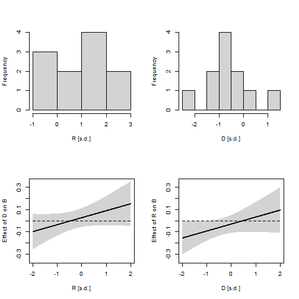 

```
## 100*R2 for linear model mod.DR.lm : 
## 11 
## 100*R2 for linear model mod.D_R.lm : 
## 10 
## 100*R2 for linear model mod.D.lm : 
## 10 
## 100*R2 for linear model mod.R.lm : 
## 10 
## 100*R2 for linear model mod.0.lm : 
## 10 
## 
## AIC of best model: 2969 
## 
## Model evaluation completed and tabulated:
```

```
##         mod.name dAICc.lib dAICCc.con df A.weight D_low D_high R_low
## mod.0      mod.0       0.0        0.0  3        1    NA     NA    NA
## mod.R      mod.R       4.1        2.1  4        0    NA     NA -0.13
## mod.D      mod.D       6.0        4.0  4        0 -0.04   0.11    NA
## mod.D_R  mod.D_R      10.7        6.6  5        0 -0.07   0.09 -0.13
## mod.DR    mod.DR      14.9        8.9  6        0 -0.06   0.11 -0.11
##         R_high DR_low DR_high D_est R_est DR_est
## mod.0       NA     NA      NA    NA    NA     NA
## mod.R     0.01     NA      NA    NA -0.06     NA
## mod.D       NA     NA      NA  0.03    NA     NA
## mod.D_R   0.02     NA      NA  0.01 -0.06     NA
## mod.DR    0.05  -0.02    0.14  0.03 -0.03   0.06
```

```r

detach(yearly.weight.stat)
```


